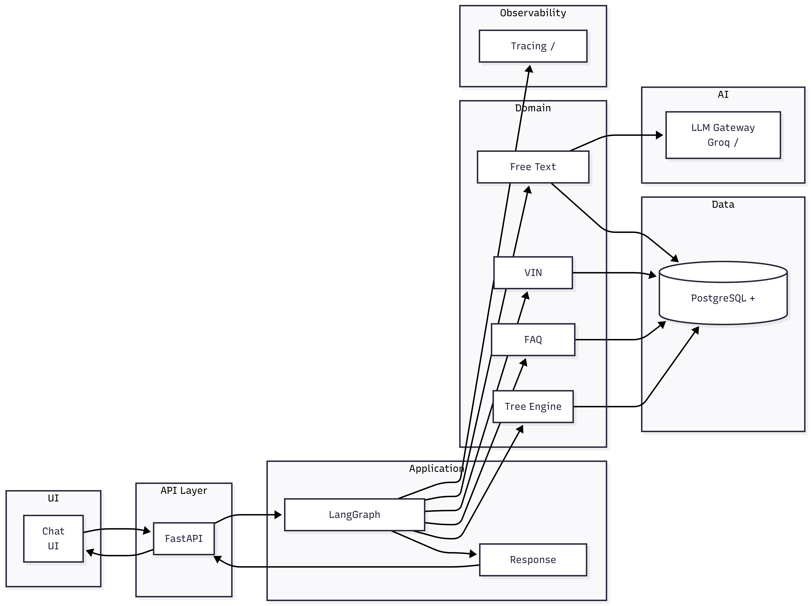
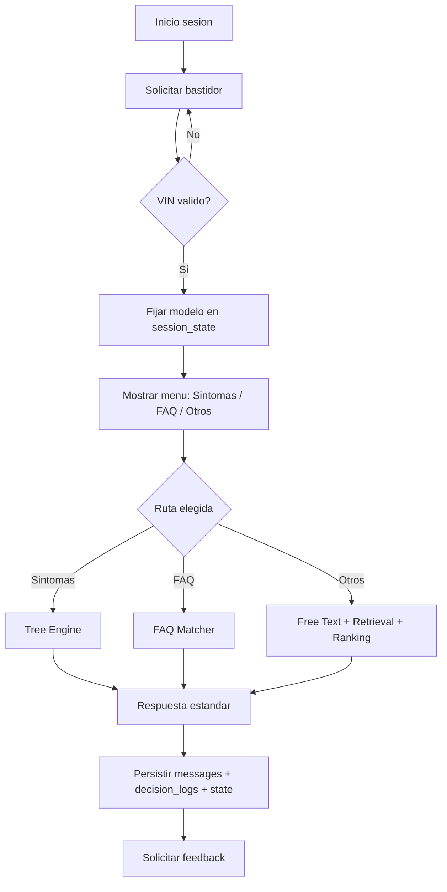
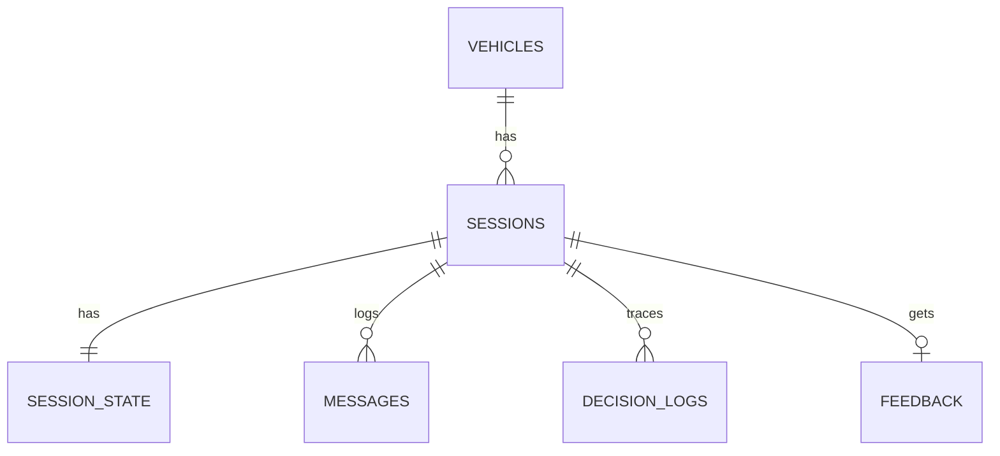

# Asistente POC - Diagnostico conversacional por bastidor

POC de asistente tecnico para motocicletas con logica hibrida:
**VIN obligatorio + arboles + FAQ + casos historicos + apoyo LLM**.

Este README sirve como **entregable de fase** y tambien como **handoff tecnico** para futuras sesiones.

---

## Tabla de contenido

1. [Checklist del entregable](#checklist-del-entregable)
2. [Handoff rapido](#handoff-rapido)
3. [Arquitectura y flujo del asistente](#arquitectura-y-flujo-del-asistente)
4. [Tecnologias y stack](#tecnologias-y-stack)
5. [Herramientas open source evaluadas](#herramientas-open-source-evaluadas)
6. [Estructura del proyecto en GitHub](#estructura-del-proyecto-en-github)
7. [Estado actual del backend](#estado-actual-del-backend)
8. [Diseno y creacion de BBDD (core + vectorial)](#diseno-y-creacion-de-bbdd-core--vectorial)
9. [Datos iniciales cargados](#datos-iniciales-cargados)
10. [Arranque local](#arranque-local)
11. [Cronograma de trabajo por tareas](#cronograma-de-trabajo-por-tareas)
12. [Criterios de cierre POC](#criterios-de-cierre-poc)
13. [Instrucciones para la siguiente sesion](#instrucciones-para-la-siguiente-sesion)

---

## Checklist del entregable

| Requisito de la fase | Estado | Seccion |
|---|---|---|
| Arquitectura y flujo del asistente | Completado | Seccion 3 |
| Estructura del proyecto en carpetas GitHub | Completado | Seccion 6 |
| Diseno y creacion de BBDD + vectorial | Completado | Seccion 8 |
| Investigacion herramientas open source para produccion | Completado | Seccion 5 |
| Cronograma de trabajo | Completado | Seccion 11 |
| Contexto util para otra sesion | Completado | Secciones 2 y 13 |

---

## Handoff rapido

Si entras en una nueva sesion, este es el resumen operativo:

- Estructura base creada: `apps`, `infra`, `data`, `scripts`, `packages`.
- BBDD core + vectorial creada por migraciones SQL idempotentes.
- Endpoints base implementados para sesion/feedback/metricas.
- Flujo actual de `SessionUseCases` esta en modo bootstrap (in-memory temporal).
- Siguiente bloque recomendado: **BE-01** (repositorios SQL reales para sessions/state).

Referencia funcional del negocio:
`DDT_POC_Asistente_Conversacional.docx`.

---

## Arquitectura y flujo del asistente

### Diagrama visual de arquitectura



### Explicacion de la arquitectura

La arquitectura implementada es un **monolito modular por capas**, pensada para una POC rapida pero con estructura de crecimiento a MVP.

| Capa / Bloque | Responsabilidad | Componentes actuales |
|---|---|---|
| UI | Interfaz conversacional y menu guiado | Next.js (Chat UI) |
| API Layer | Contrato HTTP, validacion de entrada/salida | FastAPI (`/session/*`, `/metrics/summary`) |
| Application | Orquestacion del flujo conversacional | LangGraph + use cases |
| Domain Modules | Logica de negocio por capacidad | VIN, FAQ, Tree Engine, Free Text, Retrieval, Ranking, Response Builder |
| Data | Estado transaccional y conocimiento tecnico | PostgreSQL + pgvector |
| AI | Clasificacion/redaccion con fallback multi-proveedor | LLM Gateway (Groq primario, OpenRouter fallback) |
| Observability | Trazas y diagnostico operativo | decision logs + base OTEL/logging |

#### Como fluye un turno en esta arquitectura

1. La UI envia el mensaje a FastAPI.
2. El orquestador decide la ruta (VIN, FAQ, Tree u Otros).
3. El modulo correspondiente consulta BD y, si aplica, usa el gateway LLM.
4. Response Builder genera salida estandar.
5. Se persisten `messages`, `decision_logs` y `session_state`.
6. La API devuelve respuesta final a la UI.

### Flujo funcional (Mermaid)



### Principios de arquitectura

- VIN obligatorio antes de diagnostico.
- Modelo fijado por lookup, no por inferencia de texto.
- Estado de sesion en BD como fuente de verdad.
- LLM como apoyo, no como motor unico.
- Trazabilidad completa por turno y modulo.
- POC simple de operar, preparada para escalar a MVP.

---

## Tecnologias y stack

| Capa | Tecnologia elegida | Motivo |
|---|---|---|
| UI | Next.js + React + TypeScript | Rapidez para chat UI y despliegue |
| API | FastAPI + Python | Productividad alta para integracion IA |
| Orquestacion | LangGraph | Flujo conversacional controlado |
| BBDD core | PostgreSQL | Solida, portable y estandar |
| BBDD vectorial | pgvector sobre PostgreSQL | OLTP + vector en un solo sistema |
| LLM | Groq + OpenRouter | Buen coste/rendimiento y fallback |
| Observabilidad | OpenTelemetry + logs estructurados | Trazabilidad tecnica |
| Infra local | Docker Compose | Entorno reproducible |

---

## Herramientas open source evaluadas

### Base de datos y vector DB

| Categoria | Opcion | Pros | Contras | Recomendacion |
|---|---|---|---|---|
| SQL + vector unificado | PostgreSQL + pgvector | Menor complejidad, un solo motor | Menos especializado que vector DB puro | **Elegida para POC** |
| Vector DB dedicada | Qdrant | Muy buena para retrieval vectorial | Segundo sistema a operar | Opcional para alta escala |
| Vector DB dedicada | Weaviate | Buen ecosistema semantic search | Complejidad operativa mayor | Opcional para alta escala |
| Managed Postgres + vector | Supabase | Rapido de operar, auth/storage extra | Dependencia de proveedor | **Muy buena para MVP/produccion inicial** |

### LLM y gateway

| Opcion | Rol recomendado |
|---|---|
| Groq | Proveedor primario por latencia/coste |
| OpenRouter | Fallback multi-modelo |
| Gateway propio backend | Evita acoplar dominio a proveedor |

### Despliegue

| Capa | Opcion recomendada | Alternativas |
|---|---|---|
| Frontend | Vercel | Netlify, Cloudflare Pages |
| Backend API | Render / Fly.io / Railway | Kubernetes, ECS/Fargate |
| BBDD | Supabase Postgres + pgvector o Neon + pgvector | Postgres autogestionado |
| Observabilidad | Grafana stack + OTEL | Soluciones SaaS |

Stack sugerido para MVP:
- Front en **Vercel**
- API en **Render/Fly**
- DB en **Supabase (Postgres + pgvector)**
- LLM via **Groq + OpenRouter**

---

## Estructura del proyecto en GitHub

```text
.
|-- apps/
|   |-- api/
|   |   |-- app/
|   |   |   |-- api/v1/endpoints/
|   |   |   |-- application/
|   |   |   |-- core/
|   |   |   |-- domain/
|   |   |   |-- infrastructure/
|   |   |   |-- modules/
|   |   |   `-- schemas/
|   |   `-- tests/
|   `-- web/
|       `-- src/
|-- infra/
|   |-- db/{migrations,seeds}
|   |-- docker/
|   `-- observability/
|-- data/
|   |-- diagnostic_trees/
|   |-- prompts/
|   `-- seeds/
|-- scripts/{db,dev}
|-- packages/{contracts,shared-utils}
|-- diagrama-arquitectura.png
|-- Makefile
|-- .env.example
`-- README.md
```

### Carpetas/ficheros principales ya completados

| Ruta | Estado | Objetivo |
|---|---|---|
| `apps/api/app/main.py` | Creado | Arranque FastAPI |
| `apps/api/app/api/v1/endpoints/*` | Creado | Endpoints base |
| `apps/api/app/modules/*` | Creado | Modulos funcionales base |
| `apps/api/app/infrastructure/llm/*` | Creado | Gateway + providers |
| `infra/db/migrations/*.sql` | Creado | Esquema core + vectorial |
| `infra/db/seeds/001_seed_mock.sql` | Creado | Seed de POC |
| `data/diagnostic_trees/*.json` | Creado | Arboles de diagnostico |
| `data/seeds/*.json` | Creado | Datos mock JSON |
| `scripts/db/*` y `scripts/dev/*` | Creado | Operacion local |
| `apps/web/*` base | Creado | UI bootstrap |

---

## Estado actual del backend

### Endpoints disponibles

- `POST /api/v1/session/start`
- `POST /api/v1/session/message`
- `GET /api/v1/session/{session_id}`
- `POST /api/v1/session/{session_id}/feedback`
- `GET /api/v1/metrics/summary`
- `GET /api/v1/health`

### Implementado

- Router de sesion y metricas.
- Orquestador base de rutas conversacionales.
- Servicios base VIN/FAQ/Tree/Otros.
- LLM gateway Groq/OpenRouter.

### Pendiente critico

- Reemplazar in-memory de `SessionUseCases` por repositorios SQL reales.

---

## Diseno y creacion de BBDD (core + vectorial)

Migraciones SQL en `infra/db/migrations`:

1. `000_extensions.sql` (`pgcrypto`, `vector`)
2. `001_core_schema.sql`
3. `002_core_indexes.sql`
4. `003_vector_schema.sql`
5. `004_metrics_views.sql`
6. `005_hardening_and_vector_ops.sql`

### ER simplificado (core)



### Tablas core

| Tabla | Funcion |
|---|---|
| `vehicles` | Catalogo de bastidores y metadatos |
| `sessions` | Cabecera de sesion de diagnostico |
| `session_state` | Estado vivo de la conversacion/diagnostico |
| `messages` | Registro de mensajes usuario/asistente |
| `decision_logs` | Registro de decisiones por modulo |
| `feedback` | Evaluacion final |
| `faqs` | FAQ por modelo/categoria |
| `diagnostic_trees` | Arboles JSON versionados |
| `historical_cases` | Casos historicos para apoyo en Otros |

### Capa vectorial

#### `knowledge_chunks`
- Fuente unificada (`faq`, `historical_case`, `tree_node`)
- `embedding vector(1024)` + `tsvector lexical`
- `embedding_status` (`pending`, `ready`, `failed`)
- `embedding_provider`, `embedding_model`, `metadata`

#### `embedding_jobs`
- Cola para generar embeddings de forma asincrona
- Reintentos y registro de ultimo error

### Retrieval hibrido

Funcion SQL `hybrid_search(...)`:
- score vectorial + lexical ponderado
- filtro por modelo/sintoma con fallback global
- salida top candidatos para ranking de hipotesis

### Hardening aplicado

- Constraints de estados y rangos.
- Controles de no negativos.
- Indices HNSW/GIN/BTREE.
- Triggers `updated_at`.

---

## Datos iniciales cargados

### Seed SQL

`infra/db/seeds/001_seed_mock.sql`:
- 4 VIN mock
- 4 FAQ
- 5 casos historicos
- 2 arboles (`AK550_PARADAS_V1`, `AK550_CELP_V1`)

### JSON y prompts

- `data/seeds/vehicles.json`
- `data/seeds/faqs.json`
- `data/seeds/historical_cases.json`
- `data/diagnostic_trees/AK550_PARADAS_V1.json`
- `data/diagnostic_trees/AK550_CELP_V1.json`
- `data/prompts/free_text_parser.system.txt`
- `data/prompts/response_builder.system.txt`

---

## Arranque local

### 1) Variables de entorno

Copiar `.env.example` a `.env` y completar:
- `GROQ_API_KEY`
- `OPENROUTER_API_KEY`

### 2) Base de datos

```bash
make db-up
make db-migrate
make db-seed
```

### 3) Backend

```bash
make api-install
make api-run
```

### 4) Frontend

```bash
make web-install
make web-run
```

---

## Cronograma de trabajo por tareas

### Estado general

- Completado: estructura base, migraciones, seed, bootstrap API/web.
- Siguiente foco: persistencia SQL real y cierre de flujo E2E.

### Fases

| Fase | Objetivo | Tareas |
|---|---|---|
| F1 | Persistencia real | BE-01, BE-02, BE-03, BE-04 |
| F2 | Orquestacion completa | ORCH-01, ORCH-02 |
| F3 | Modulos diagnostico | TREE-01, FAQ-01, OTH-01..OTH-04 |
| F4 | API y UI E2E | API-01, API-02, FE-01 |
| F5 | Calidad y release | QA-01, REL-01 |

### Backlog detallado

| ID | Bloque | Tarea | Entregable | Depende de |
|---|---|---|---|---|
| PLAT-01 | Plataforma | Estandarizar tooling Python | Base backend homogenea | - |
| PLAT-02 | Plataforma | Lint/format/type-check | Calidad automatizable | PLAT-01 |
| BE-01 | Persistencia | Repositorios SQL para `sessions` y `session_state` | Estado en BD real | PLAT-01 |
| BE-02 | Persistencia | Repositorios SQL para `messages`, `decision_logs`, `feedback` | Trazabilidad persistente | BE-01 |
| BE-03 | Persistencia | Repositorios SQL para `vehicles`, `faqs`, `diagnostic_trees`, `historical_cases` | Lectura de conocimiento real | BE-01 |
| BE-04 | Persistencia | Sustituir in-memory en `SessionUseCases` | Casos de uso DB-backed | BE-01, BE-02 |
| ORCH-01 | Orquestacion | Estado tipado de LangGraph | Contrato de flujo | BE-04 |
| ORCH-02 | Orquestacion | Grafo completo (VIN/menu/FAQ/tree/otros/response) | Orquestador productivo | ORCH-01 |
| TREE-01 | Arbol | Ejecucion real desde `diagnostic_trees` | Diagnostico guiado real | BE-03 |
| FAQ-01 | FAQ | Matcher por modelo + fallback general | FAQ operativa | BE-03 |
| OTH-01 | Otros | Parsing libre (reglas + LLM) | Tags/categoria robusta | ORCH-02 |
| OTH-02 | Otros | Ingestion de `knowledge_chunks` | Corpus vectorial inicial | BE-03 |
| OTH-03 | Otros | Worker de `embedding_jobs` | Embeddings operativos | OTH-02 |
| OTH-04 | Otros | Retrieval con `hybrid_search` + top-3 | Modulo Otros completo | OTH-03 |
| API-01 | API | Endpoints conectados a orquestador + BD real | API funcional E2E | ORCH-02, BE-04 |
| API-02 | API | `/metrics/summary` desde `v_metrics_summary` | KPI reales | BE-02 |
| FE-01 | Frontend | Chat completo + salida estandar | UX demo completa | API-01 |
| QA-01 | QA | Unit + integration + e2e | Validacion CA-001..CA-010 | FE-01, API-02 |
| REL-01 | Release | Checklist final de entrega | Demo estable | QA-01 |

### Siguiente tarea concreta

**BE-01**: crear repositorios SQL e integrar `SessionUseCases` para eliminar in-memory.

---

## Criterios de cierre POC

La POC se considera cerrada cuando:

- VIN obligatorio se respeta en todo flujo.
- `session_state` es fuente de verdad real en BD.
- FAQ, Tree y Otros funcionan con trazabilidad completa.
- Otros devuelve top-3 por modelo usando retrieval hibrido.
- UI y API cubren flujo completo hasta feedback.
- Se cumplen CA-001..CA-010 del DDT.

---

## Instrucciones para la siguiente sesion

1. Leer este `README.md` completo.
2. Continuar por **BE-01**.
3. Mantener foco en:
   - estado en BD,
   - trazabilidad (`messages`, `decision_logs`),
   - contrato de salida estandar.
